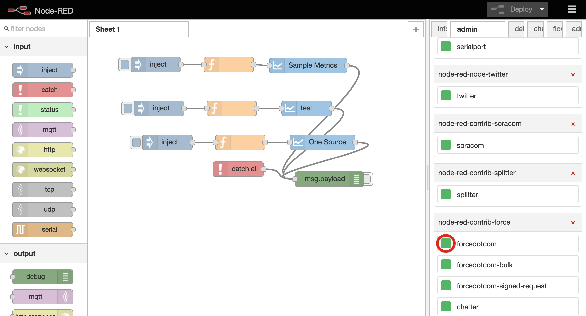

node-red-contrib-admin
========================
An admin tab for <a href="http://nodered.org" target="_new">Node-RED</a>.

Search Node
-------

Install Node
-------

Uninstall Node
-------

Enable Node
-------

Disable Node
-------

Install
-------

Run the following command in the root directory of your Node-RED install

    npm install node-red-contrib-admin

License
-------

See [license] (https://github.com/enebular/node-red-contrib-admin/blob/master/LICENSE) (Apache License Version 2.0).